# **Lab 4: Building a Secure Inventory System with SQL Server 2025, GitHub Copilot, and Data APIs​**

In today’s retail and warehouse environments, businesses need fast,
secure, and intelligent ways to manage inventory data. In this hands-on
lab, you step into the role of a database developer working for a
growing retail company that wants to modernize its inventory system.
Using **SQL Server 2025**, **GitHub Copilot**, and **Data API Builder**,
you build the SmartInventoryDB from scratch, automate development tasks
with AI assistance, apply security controls, and expose the database as
REST and GraphQL APIs for application integration. This lab demonstrates
how modern SQL development goes beyond writing queries — it integrates
AI, security, and API-driven architecture.

**Objectives**

By completing this lab, participants will be able to:

- Create and configure the **SmartInventoryDB** database

- Design schema and tables for inventory management

- Generate SQL queries and stored procedures using **GitHub Copilot**

- Implement role-based security in **SQL Server 2025**

- Apply Dynamic Data Masking and permission controls

- Expose database tables as REST and GraphQL APIs using **Azure Data API
  Builder**

## **Exercise 1: Connect SQL Server 2025 on VS Code**

1.  Open **Visual Studio Code** and navigate to the **Extensions**
    section from the left pane.

2.  Search for **GitHub Copilot** Extension and make sure it is
    installed.

    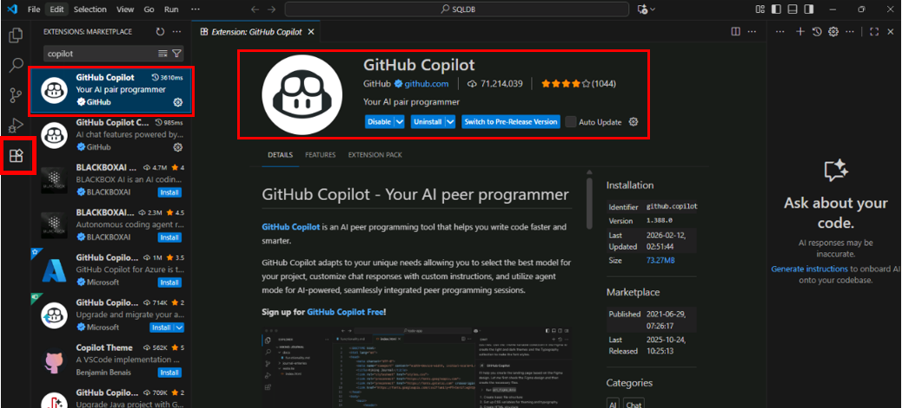

3.  Now, Search for **MSSQL** Extension and click on **Install**. The
    MSSQL extension allows VS Code to connect and run queries against
    SQL Server.

    

4.  Click on **Close** if welcome screen appears.

    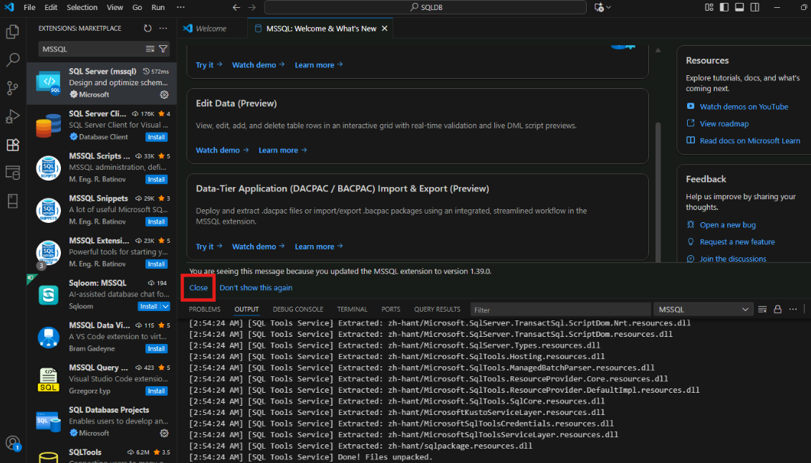

5.  To create the connection, open the **connection** dialog.

    

6.  On the Connection Dialog, enter the **Server Name** as the **Public
    IP address** of the VM that you have copied earlier followed by a
    comma and default port number (1433). You can see the example below:

    **Your Public IP address,1433**

    

7.  Select **Authentication** type as **SQL Login** and enter the
    **username** and **password** that you have created in the VM in
    Exercise 1.

8.  Initially, you can enter the database name as **master**. Click on
    **Connect**.

    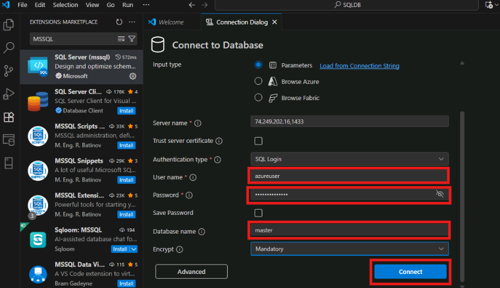

9.  Enable the **Trust Server Certificate**.

    

10. You should now see your server in the SQL Server panel.

    

## **Exercise 2: Copilot Experiences for Schema Design & Query Generation** 

### **Task 1: Create a Database**

1.  **Right-click** on the Server and select **New Query** option.

    

2.  Create a **new database** by entering the below query in the editor
    and click on **Run** button to execute the query.

    ```
    CREATE DATABASE SmartInventoryDB;
    GO
    USE SmartInventoryDB;
    ```

    

3.  You should now see “Commands completed successfully”. To verify the
    database, expand the **Databases** section (You might need to
    refresh it once).

    

### **Task 2: Create a Schema and a Table**

4.  Select the **SmartInventoryDB** and open a **new query** editor.

    

5.  Enter the below query. This will create a **schema** as ‘**core’**
    and a **table** as ‘**Products’** with some columns:

    ```
    CREATE SCHEMA core;
    GO

    CREATE TABLE core.Products (
        ProductID INT PRIMARY KEY IDENTITY(1,1),
        ProductName NVARCHAR(100),
        Category NVARCHAR(50),
        Price DECIMAL(10,2),
        StockQuantity INT,
        CreatedDate DATETIME DEFAULT GETDATE()
    );
    ```

    Click on **Run** to execute the query.

    

6.  Once you see the output as commands completed successfully,
    **refresh** the database from the left pane and expand the
    **Tables** section to see the new **Products** table.

    

7.  Insert **Sample data** as per the columns you have created in the
    previous step. **Execute** the query and you’ll see the number of
    rows affected as the output:  
      
    ```
    INSERT INTO core.Products (ProductName, Category, Price, StockQuantity)
    VALUES 
    ('Laptop', 'Electronics', 75000, 5),
    ('Mouse', 'Electronics', 500, 50),
    ('Office Chair', 'Furniture', 8000, 8);
    ```

    

### **Task 3: Use Copilot to generate SQL query**

Generate queries using natural language and improve productivity.

8.  To access copilot features in VS Code, you need to **sign in** with
    your github account. Navigate to **Settings** from the left-bottom
    pane and **sign in to sync settings**.

    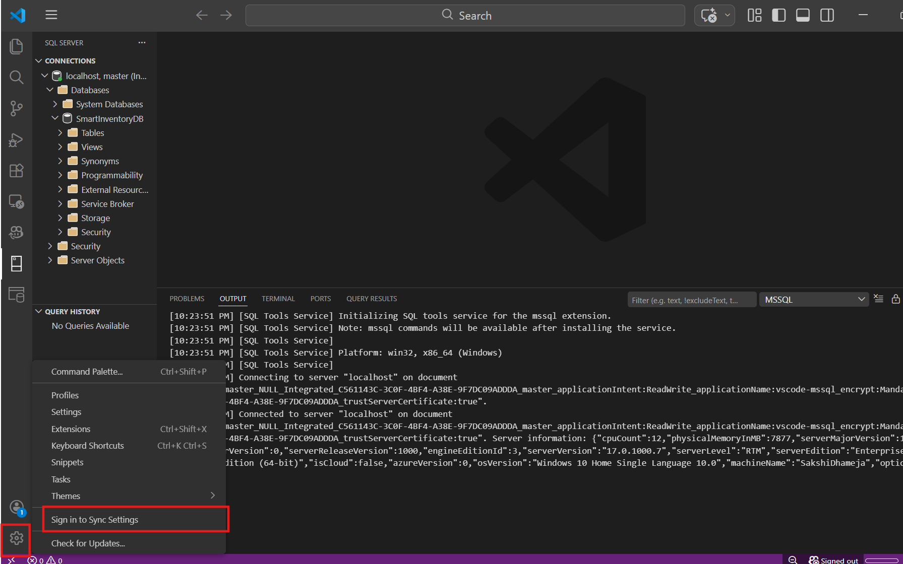

9.  Enter the **GitHub account** credentials and click on **Sign in**.

    

10. You can now switch back to the **VS Code** and check you’re signed
    in.

    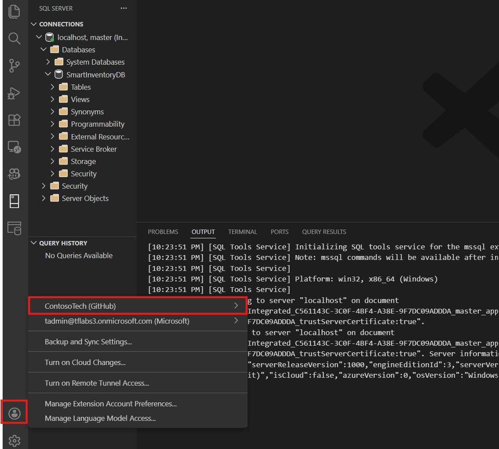

11. Now, generate a query using copilot. Enter the **comment** given
    below and press **Enter**. Wait for the copilot suggestions.

    ```
    -- Using table core.Products with columns ProductName and StockQuantity
    -- Find products where StockQuantity is less than 50
    ```

    

12. Press **Tab** to accept the copilot **suggestions**. Copilot reads
    your comment and generates SQL query automatically.

    Once the query is accepted, you can proceed with executing the command.

> 

13. Based on the comment and the query generated by copilot, you can see
    the output of two products that are having the StockQuantity less
    than 50.

    

### **Task 4: Use Copilot Chat to create a Stored Procedure**

14. From the top of the VS Code, open a **new copilot chat**.

    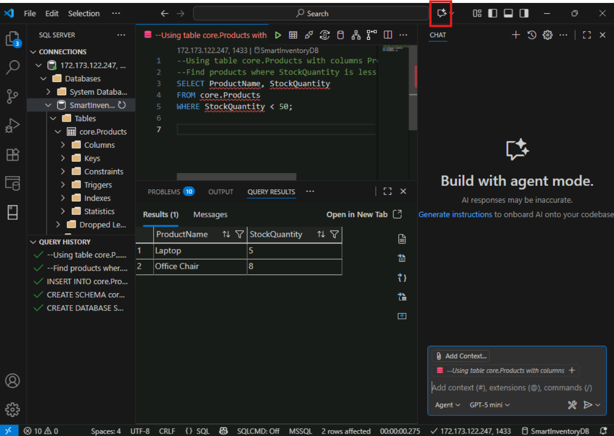

15. **Important:** Make sure **Agent** mode is selected and you can
    select the model as per your requirements.

16. Enter the **prompt** to create a stored procedure under the
    SmartInventoryDB:

    ```
    We are using SQL Server 2025.
    Database: SmartInventoryDB
    Table: core.Products
    Columns: ProductID (INT, Primary Key), ProductName (NVARCHAR), Price (DECIMAL), StockQuantity (INT)
    Write a stored procedure named core.RestockProduct that:
    •	Accepts @ProductID INT
    •	Accepts @QuantityToAdd INT
    •	Increases StockQuantity by @QuantityToAdd
    •	Returns a message if product does not exist
    •	Prevents negative quantity input
    ```

    

17. You will see a query is generated to create a stored procedure.
    Click on **Apply in Editor.**

    

18. VS Code will ask you that you want to open the query in the new
    editor or the existing one. You can select **New untitled editor**.

    

19. Once added in the Editor, Execute the query and make sure you see
    the commands completed successfully as the output.

    

### **Task 5: Verify the Stored Procedure**

**Verify Existing Product Data:**

20. Open a **new query** editor for the **SmartInventoryDB**.

    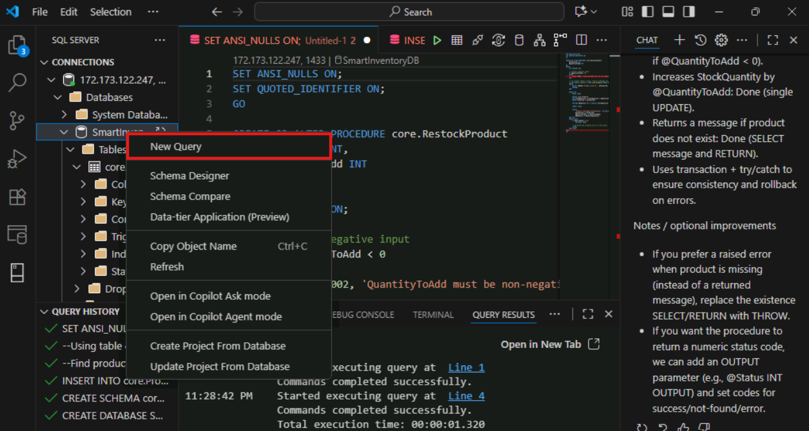

21. **Execute** the below query. This will check the current stock and
    note down the current **StockQuantity**.

    ```
    SELECT ProductID, ProductName, StockQuantity
    FROM Products
    WHERE ProductID = 1;
    ```

    

22. The output shows the current StockQuantity as 5.

    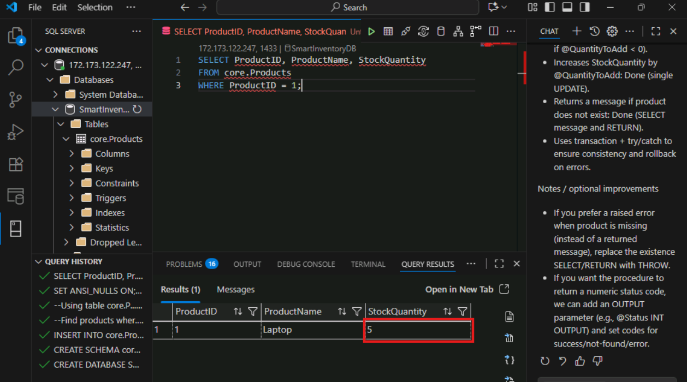

**Execute the Stored Procedure:** Now, we will restock the product.

23. Execute the stored procedure with the below given query.

    ```
    EXEC RestockProduct 
    @ProductID = 1,
    @QuantityToAdd = 10;
    ```

    - **@ProductID** = 1 --- Which product we are restocking

    - **@QuantityToAdd** = 10 --- How many units we are adding

    **Check the output where you’ll see the QuantityAdded =10 and NewStockQuantity = 15.**

    

24. You can verify the updated stock again.

    ```
    SELECT ProductID, ProductName, StockQuantity
    FROM Products
    WHERE ProductID = 1;
    ```

    After running the command, you will the see that StockQuantity is now
    increased by 10 as earlier it was 5. This confirms that stored procedure
    works correctly.

    

## **Exercise 3: Security & Governance with SQL Server 2025​**

Goal- Apply role-based access and masking

### **Task 1: Assign a Role and add a user in the database**

1.  **Right-click** on the SmartInventoryDB and select **New Query**
    option.

    

2.  Run the query to assign a role. This command creates a database role
    named **InventoryViewer** and grants it permission to read (SELECT)
    data from the **core.Products** table.

    ```
    CREATE ROLE InventoryViewer;
    GRANT SELECT ON core.Products TO InventoryViewer;
    ```

    **Execute** the command.

    

3.  We cannot verify this role because a role cannot execute the
    queries. Only a user can. **Create a login for a InventoryUser** and
    **Execute** the query:

    ```
    CREATE LOGIN InventoryUser WITH PASSWORD = 'StrongPassword@123';
    ```

    

4.  Now, create the **Database User**. A login allows access to SQL
    Server. A user allows access to a specific database. Roles work at
    the database level, so the user must exist inside the database
    first.

    ```
    CREATE USER InventoryUser 
    FOR LOGIN InventoryUser;
    ```

    **Execute** the query:


5.  You can now add this user to the Role. Run the below query:

    ```
    ALTER ROLE InventoryViewer
    ADD MEMBER InventoryUser;
    ```

    

### **Task 2: Verify Permission Restriction for the User**

6.  **Verify as Admin (Current Login):** Run the given query

    ```
    SELECT ProductID, ProductName, StockQuantity
    FROM Products;
    ```
    Admin has the unrestricted access so you will be having full data visibility.

    

7.  **Verify as InventoryUser (Role Member):**

    ```
    EXECUTE AS USER = 'InventoryUser';
    SELECT ProductID, ProductName, StockQuantity
    FROM Products;
    REVERT;
    ```

**What This Proves?**

- InventoryUser can **SELECT** because of InventoryViewer role.

- If you did NOT grant UPDATE/DELETE — those operations should fail.

    

8.  **Test Permission Restriction:**

    ```
    EXECUTE AS USER = 'InventoryUser';
    UPDATE Products 
    SET StockQuantity = 100
    WHERE ProductID = 1;
    REVERT;
    ```

When executed, you’ll receive ‘Permission denied’ error. Roles simplify
permission management. Instead of granting permissions to each user, we
grant them to a role and add user to that role.

**You have NOT granted UPDATE/DELETE, hence. this operation failed.**

    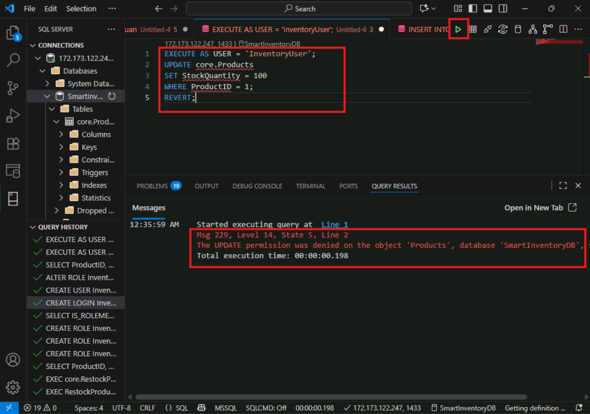

### **Task 3: Dynamic Data Masking and Verify Unmask permission**

9.  Run this query:

    ```
    ALTER TABLE core.Products
    ALTER COLUMN Price
    ADD MASKED WITH (FUNCTION = 'default()');
    ```

This command modifies the **core.Products** table to apply a dynamic
data mask on the **Price** column, so users without proper permission
will see a masked (hidden) value instead of the actual price.

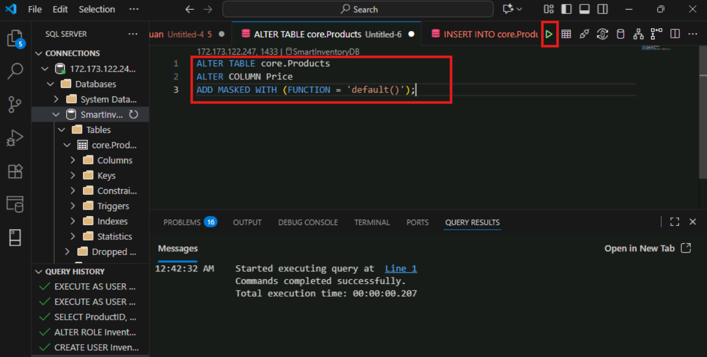

10. **Verify as Admin (Unmasked View):** Run the below query

    ```
    SELECT ProductName, Price
    FROM core.Products;
    ```

**You will see real price values because SQL Server shows actual data
to user with unmask permission.**

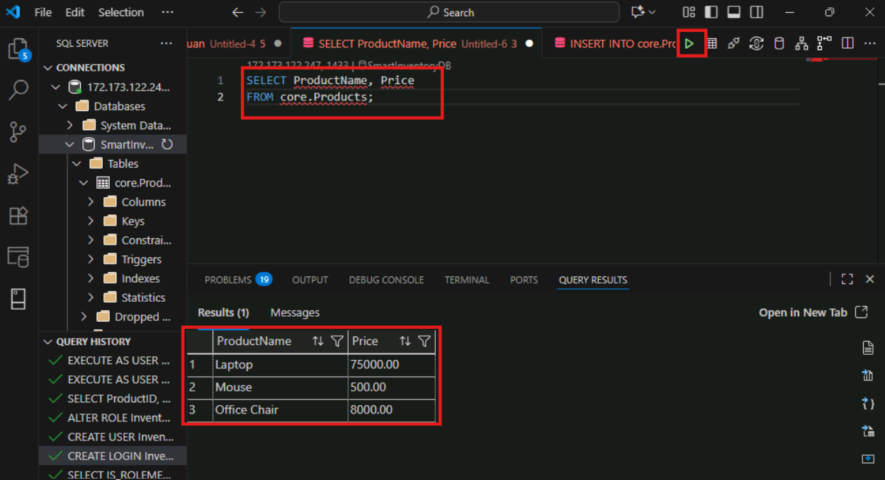

11. **Verify as Restricted User:** Now, test using your database user
    (InventoryUser)

    ```
    EXECUTE AS USER = InventoryUser;
    SELECT ProductName, Price 
    FROM core.Products;
    REVERT;
    ```

Just because you used - FUNCTION = 'default()' , this will hide the
numeric values for the Masked column i.e., Price.

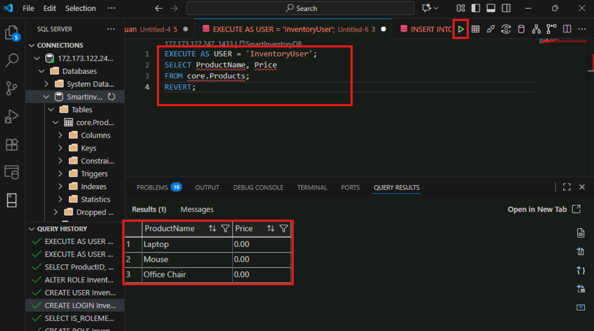

12. **Grant UNMASK Permission Temporarily:**

    ```
    GRANT UNMASK TO InventoryUser;
    ```

    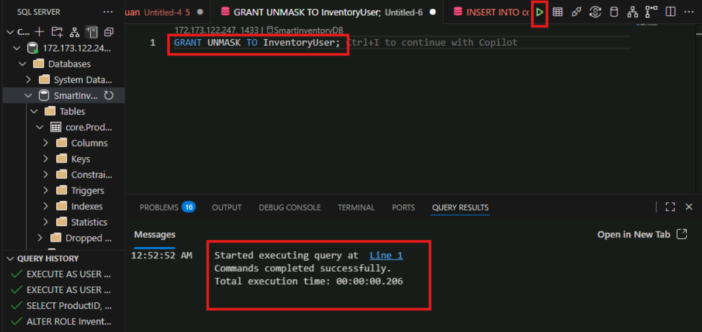

13. After providing the unmask permission, you can test again. Now, the
    real price will be visible. This mainly reinforces the security
    concept.

    ```
    EXECUTE AS USER = InventoryUser;
    SELECT ProductName, Price 
    FROM core.Products;
    REVERT;
    ```

    

## **Exercise 4: Exposing SQL Data to AI Applications using Data API Builder​**

Allow external applications to access database.

1.  Open a **New terminal** in VS Code.

    

2.  Install **Data API Builder** with the help of this command:

    ```
    dotnet tool install --global Microsoft.DataApiBuilder
    ```

    

    

3.  Navigate to **File Explorer** and create **a new folder**.

    

4.  Name the folder as **SQLDB**

    

5.  Switch back to **VS Code** and click on **Open folder** from the
    explorer.

    

6.  Select the **SQLDB** folder to open in the VS Code.

    

7.  Once you have opened the folder, check the connection as it might
    get disconnected. If you see a red dot, this means it is
    disconnected. To **connect** again, click on the Server and enter
    the password that you have mentioned in the VM for the Server and
    press **Enter**.

    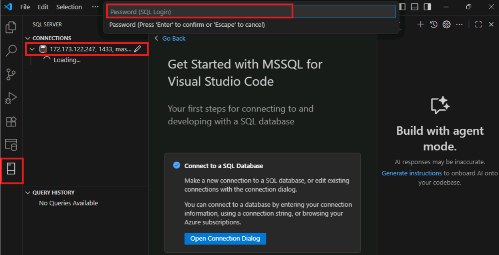

8.  Green represents that the server is connected.

    

9.  Open a **new Terminal**.

    

10. Inside a new folder, initialize the config file. This command
    **initializes a new Data API Builder project configuration** for a
    Microsoft SQL Server database.

    ```
    dab init --database-type mssql
    ```

    

11. You will notice that under SQLDB folder, a new **dab-config.json**
    file is created.

    

12. Open the file and find the **Connection String**. Within the double
    quotes, enter this connection string and replace Public IP address in the Server and make sure UserID and password are correct. 

    ```
    Server=\<Public IP Address, 1433\>;Database=SmartInventoryDB;User
    ID=sqlvmuser;Password=AZvmsql12345;TrustServerCertificate=True;
    ```


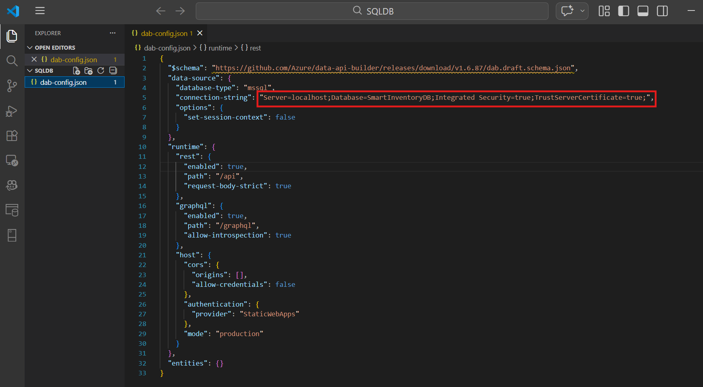

13. Edit the dab-config.json file. Replace the last empty ‘**entities’**
    with the below json.

    ```
    "entities": {
    "Products": {
        "source": "core.Products",
        "permissions": [
        {
            "role": "anonymous",
            "actions": ["read"]
        }
        ]
    }
    }
    ```

    

    

14. Make sure to change the **authentication provider** as “**StaticWebApps**”

    

15. Make sure your dab-config.json file looks like this:

    ```
    {  
      "$schema":
    "<https://github.com/Azure/data-api-builder/releases/download/v1.7.90/dab.draft.schema.json%22>,  
      "data-source": {  
        "database-type": "mssql",  
        "connection-string":
    "Server=20.106.17.61,1433;Database=SmartInventoryDB;User
    ID=sqlvmuser;Password=AZvmsql12345;TrustServerCertificate=True;",  
        "options": {  
          "set-session-context": false  
        }  
      },  
      "runtime": {  
        "rest": {  
          "enabled": true,  
          "path": "/api",  
          "request-body-strict": true  
        },  
        "graphql": {  
          "enabled": true,  
          "path": "/graphql",  
          "allow-introspection": true  
        },  
        "mcp": {  
          "enabled": true,  
          "path": "/mcp"  
        },  
        "host": {  
          "cors": {  
            "origins": \[\],  
            "allow-credentials": false  
          },  
          "authentication": {  
            "provider": "StaticWebApps"  
          },  
          "mode": "development"  
        }  
      },  
      "entities": {  
    "Products": {  
        "source": "core.Products",  
        "permissions": \[  
        {  
            "role": "anonymous",  
            "actions": \["read"\]  
        }  
        \]  
    }  
    }  
    }
    ```

16. Now, **start the Data Api Builder.** The command dab start launches
    **Data API Builder** by reading your configuration file
    (dab-config.json) and starting the REST and GraphQL endpoints that
    expose your database as APIs through Dapr.

    ```
    dab start
    ```

**Note**: Make sure you don’t close this terminal. You can expand or
collapse if needed.


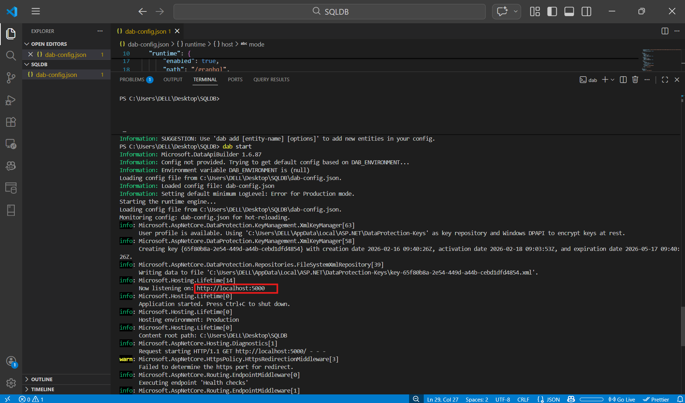

17. Open your browser and navigate to this url. You should see JSON
    output. This means that now SQL is exposed as REST API.

    ```
    http://localhost:5000/api/Products
    ```


18. Now, it’s time to test GraphQL. Navigate to VS Code. Find the
    graphql mode as **production**. You need to update it as
    **development**. When DAB runs in **production mode**, it disables
    the GraphQL UI (Playground).


19. Expand the terminal if it is collapsed and press **Ctrl + C** to
    shutdown the dab that you have started using dab start command.

Once you press Ctrl+C, you will see that application is shutting down.

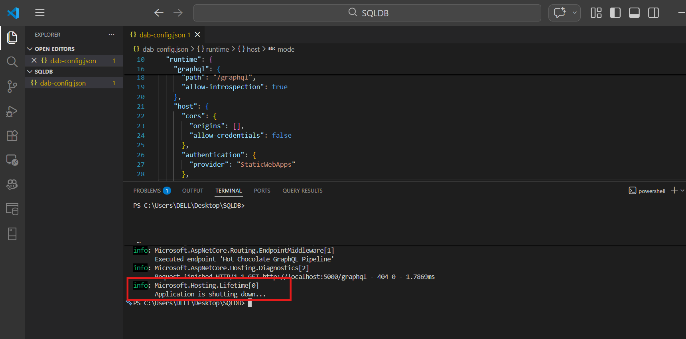

20. Again, start the Data Api Builder:

    ```
    dab start
    ```


21. Navigate to your browser and enter the graphql url:

    ```
    http://localhost:5000/graphql
    ```

    The **Nitro page** you are seeing is actually the **GraphQL Playground
    interface** provided by Data API Builder. You can think of it like
    SSMS for SQL or Postman for APIs.

    Click on **Browse Schema** on the Homepage and Navigate to **Operation** tab.


22. Inside the **Nitro** interface, in the left panel – write the below
    query and click on **Run**.

    ```
    query {
    products {
        items {
        ProductID
        ProductName
        Category
        Price
        StockQuantity
        CreatedDate
        }
    }
    }
    ```

    **Note:** If you remember, we have specified the table name as
    ‘Products’- means with capital P and here, in the query we are writing
    it as ‘products’. The reason is that DAB automatically generates GraphQL
    entities in lowercase (unless explicitly configured).

    So even though your table is: **Products**

    Your GraphQL entity is: **products**


23. You should see results on the right side. If your table has data, it
    will return the rows. When you run that query, GraphQL translates
    your query into a SQL query automatically.

    You will see the Products table data from the database including all
    the electronic products – Laptop, Office Chair, Mouse…


## **Conclusion​**

In this lab, you successfully designed and developed a modern inventory
management database using SmartInventoryDB. You leveraged AI-powered
assistance with GitHub Copilot to improve productivity, implemented
security best practices through roles and data masking, and transformed
your database into API endpoints using Azure Data API Builder. By the
end of this exercise, you not only created a functional inventory system
but also experienced how modern SQL development combines database
design, AI assistance, governance, and API integration to build
scalable, secure, and application-ready data solutions.
